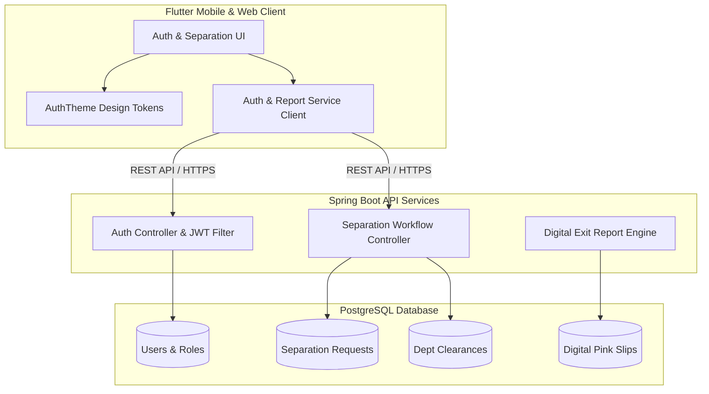

# 📋 Pink Slip Report — Project Updates & Changelog

**Repository**: [smks-007/PinkSlipReport](https://github.com/smks-007/PinkSlipReport)  
**Project**: Pink Slip Report — Scalable Employee Separation Management System  
**Tech Stack**: Flutter • Java Spring Boot • PostgreSQL • JWT Authentication  

---

## 📌 Project Overview

**Pink Slip Report** is a scalable, secure enterprise employee separation management system designed to streamline and automate the end-to-end offboarding lifecycle. It enables organizations to create, track, manage, and digitally generate verified employee exit clearance reports and separation documentation ("Pink Slips") with role-based security, audit trails, and multi-department approval workflows.

---

## 🚀 Latest Updates & Changelog

### 🔖 Version 0.2.0 (Commit `fab3036`) — Test Automation & Configuration Refactoring
* **Widget Test Suite Expansion**:
  * Added end-to-end integration tests in [`test/widget_test.dart`](file:///c:/Users/Rajavel/.gemini/antigravity/scratch/PinkSlipReport/test/widget_test.dart) covering all three authentication screens.
  * Verified screen navigation flows: `Sign In ↔ Sign Up` and `Sign In ↔ Forgot Password`.
  * Added validation trigger tests for empty fields, password minimum length constraints, and email format assertions.
* **Validation Standardization**:
  * Standardized minimum password length requirement to 8 characters across [`SignInScreen`](file:///c:/Users/Rajavel/.gemini/antigravity/scratch/PinkSlipReport/lib/auth/screens/sign_in_screen.dart) and [`SignUpScreen`](file:///c:/Users/Rajavel/.gemini/antigravity/scratch/PinkSlipReport/lib/auth/screens/sign_up_screen.dart).
* **Android Build Configuration**:
  * Configured JVM target and Kotlin compiler compatibility options in [`android/app/build.gradle.kts`](file:///c:/Users/Rajavel/.gemini/antigravity/scratch/PinkSlipReport/android/app/build.gradle.kts).
* **IDE Configuration**:
  * Added workspace configuration settings in `.vscode/settings.json`.

---

### 🔖 Version 0.1.0 (Commit `0f9a63b`) — Modern Authentication UI Module
* **Theme & Design System**:
  * Centralized design tokens defined in [`AuthTheme`](file:///c:/Users/Rajavel/.gemini/antigravity/scratch/PinkSlipReport/lib/auth/theme/auth_theme.dart) including primary brand colors (`#1565D8`), neutral shades, typography hierarchy, and input field styling.
* **Authentication Screens**:
  * **Sign In Screen** ([`SignInScreen`](file:///c:/Users/Rajavel/.gemini/antigravity/scratch/PinkSlipReport/lib/auth/screens/sign_in_screen.dart)): Card-based layout with username/password fields, password visibility toggle, "Forgot Password" routing, "Login" CTA, and social auth buttons (Google & Facebook).
  * **Sign Up Screen** ([`SignUpScreen`](file:///c:/Users/Rajavel/.gemini/antigravity/scratch/PinkSlipReport/lib/auth/screens/sign_up_screen.dart)): Registration card with Full Name, Email, and Password inputs, clickable Terms & Conditions and Privacy Policy links, and direct navigation back to Sign In.
  * **Forgot Password Screen** ([`ForgotPasswordScreen`](file:///c:/Users/Rajavel/.gemini/antigravity/scratch/PinkSlipReport/lib/auth/screens/forgot_password_screen.dart)): Email input with regex validation, "Send OTP" action flow, and return navigation.
* **Reusable UI Components**:
  * [`AuthCard`](file:///c:/Users/Rajavel/.gemini/antigravity/scratch/PinkSlipReport/lib/auth/widgets/auth_card.dart): Responsive container card with soft elevation and rounded borders.
  * [`AuthInputField`](file:///c:/Users/Rajavel/.gemini/antigravity/scratch/PinkSlipReport/lib/auth/widgets/auth_input_field.dart): Custom styled text inputs with prefix icons, clear/visibility actions, and validation error support.
  * [`AuthPrimaryButton`](file:///c:/Users/Rajavel/.gemini/antigravity/scratch/PinkSlipReport/lib/auth/widgets/auth_primary_button.dart): Full-width modern blue button with loading indicator support.
  * [`SocialLoginButton`](file:///c:/Users/Rajavel/.gemini/antigravity/scratch/PinkSlipReport/lib/auth/widgets/social_login_button.dart): Outlined brand action buttons with custom vector icons.
  * [`AuthIllustration`](file:///c:/Users/Rajavel/.gemini/antigravity/scratch/PinkSlipReport/lib/auth/widgets/auth_illustration.dart): Custom `CustomPainter` vector illustrations for login, registration, and password recovery states.
  * [`AuthDivider`](file:///c:/Users/Rajavel/.gemini/antigravity/scratch/PinkSlipReport/lib/auth/widgets/auth_divider.dart) & [`AuthLinkText`](file:///c:/Users/Rajavel/.gemini/antigravity/scratch/PinkSlipReport/lib/auth/widgets/auth_link_text.dart): Reusable dividers and formatted interactive text links.

---

## 🏛 System Architecture & Tech Stack

### 🛠 Technology Matrix
| Layer | Technologies | Role / Responsibility |
|---|---|---|
| **Mobile Frontend** | Flutter (Dart 3, Material 3) | Cross-platform UI for Android, iOS, Web, and Desktop |
| **State & Navigation** | Flutter Named Routes & Reactive State | Responsive layouts and seamless authentication flows |
| **Backend (Target)** | Java 17+, Spring Boot 3.x, Spring Security | RESTful microservices, RBAC security, business workflow |
| **Auth & Security** | JWT (JSON Web Tokens) & BCrypt | Stateless bearer token authentication & encrypted credentials |
| **Database** | PostgreSQL | ACID-compliant relational storage for separation records |
| **Testing** | Flutter Test / WidgetTester | Automated unit and widget regression test suites |

---

## 📅 Roadmap & Next Milestones

1. **Backend Integration**:
   - [ ] Implement Spring Boot REST API for authentication (`/api/v1/auth/login`, `/api/v1/auth/register`, `/api/v1/auth/forgot-password`).
   - [ ] Implement JWT token generation, refresh tokens, and Spring Security filters.
2. **Separation Workflow Engine**:
   - [ ] Multi-department clearance checklist (IT asset recovery, Finance dues, HR exit interview).
   - [ ] Real-time status tracker for exiting employees and HR managers.
3. **Digital Pink Slip Generation**:
   - [ ] PDF generation engine for digital separation certificates and exit clearance summaries.
   - [ ] Cryptographic signature / QR verification for generated reports.
